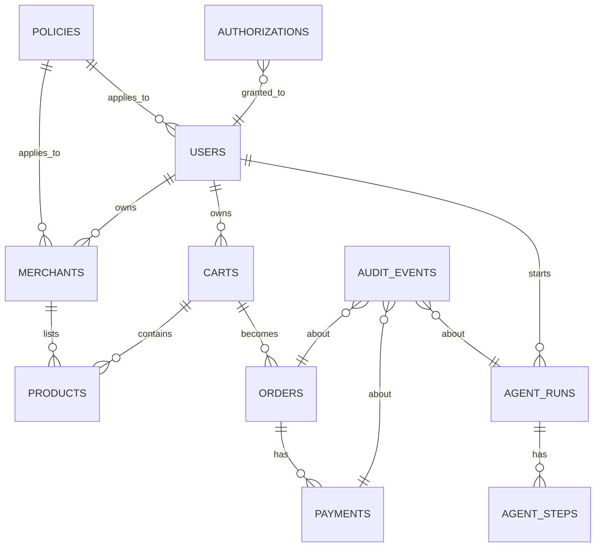

# ARTHA — Data Model (Phase 1 Design)

This document defines the primary entities, relationships, frontend/backend responsibility boundaries, an ER diagram, example JSON payloads, and a high-level API surface. It is a design artifact only — no implementation or migrations are included.

## 1. Key entities

- users
- merchants
- products
- carts
- orders
- payments
- policies
- authorizations
- agent_runs
- agent_steps
- audit_events

For each entity below we list primary fields, a short description, and important notes.

### users
- id: string (uuid)
- name: string
- email: string
- role: string (USER | MERCHANT | ADMIN)
- createdAt, updatedAt: ISO timestamps

Purpose: Application user identities. Roles determine permissions; authentication and authorization are enforced server-side.

### merchants
- id: string
- name: string
- description: string
- ownerUserId: string (references users.id)
- policyId: string (references policies.id)
- createdAt, updatedAt

Purpose: Merchant accounts that own product catalogs and configure AI-commerce policies.

### products
- id: string
- merchantId: string (references merchants.id)
- name: string
- sku: string
- price: integer (minor units, e.g., paise)
- currency: string (INR)
- condition: enum (new|refurbished|used)
- features: JSON object
- inventory: integer
- returnPolicy: JSON {days: number}
- availability: boolean
- createdAt, updatedAt

Purpose: Catalog records the orchestrator and AI agents will search. Merchant-provided content must be treated as untrusted data.

### carts
- id: string
- userId: string
- items: [{ productId, merchantId, quantity, unitPrice }]
- subtotal: integer
- currency: string
- createdAt, updatedAt

Purpose: Temporary user selection prior to order creation. Business logic such as price calculation and subtotal must be performed server-side.

### orders
- id: string
- userId: string
- merchantId: string
- cartId: string
- items: as in cart
- subtotal, discounts, tax, total: integer
- currency
- status: enum (CREATED|AWAITING_PAYMENT|PAID|CANCELLED|FAILED)
- createdAt, updatedAt

Purpose: Deterministic record of a purchase intent; used to create Razorpay orders. Final price verification is mandatory before any payment action.

### payments
- id: string
- orderId: string (references orders.id)
- razorpayOrderId?: string
- razorpayPaymentId?: string
- amount: integer
- currency
- status: enum (INITIATED|SUCCESS|FAILED|PENDING)
- metadata: JSON
- createdAt, updatedAt

Purpose: Payment lifecycle records and reconciliation; Razorpay Test Mode integration will operate on these records. Secrets remain server-side.

### policies
- id: string
- merchantId?: string
- userId?: string
- maxAutonomousTransaction: integer
- requireConfirmationAbove: integer
- approvedAgents: [string]
- createdAt, updatedAt

Purpose: Deterministic policy rules enforced by the policy engine. Policies can be global, merchant-scoped or user-scoped.

### authorizations
- id: string
- userId
- scope: string (ORDER_PURCHASE, AUTONOMOUS_SPEND)
- amount: integer
- currency
- status: enum (APPROVED|REVOKED|EXPIRED|PENDING)
- expiresAt: timestamp
- createdAt

Purpose: Explicit approvals that permit money actions. All payment actions must be validated against authorization records.

### agent_runs
- id: string
- userId
- requestText: string
- status: enum (RUNNING|COMPLETED|FAILED|CANCELLED)
- currentStep: string
- resultSummary: JSON
- startedAt, completedAt

Purpose: Track the lifecycle of a single agent execution for traceability and evaluation.

### agent_steps
- id: string
- agentRunId (references agent_runs.id)
- stepType: enum (INTENT_PARSE|TOOL_CALL|DECISION|ACTION|VERIFY)
- toolName?: string
- input: JSON
- output: JSON
- status: enum (SUCCESS|FAILED|SKIPPED)
- startedAt, completedAt

Purpose: Detailed step-level trace for audit, explainability, and evaluation.

### audit_events
- id: string
- actor: string (USER|ARTHA_AGENT|SYSTEM|MERCHANT)
- action: string
- resource: string
- resourceId: string
- decision: string (ALLOW|BLOCK|INFO|ERROR)
- reason?: string
- metadata: JSON
- timestamp

Purpose: Canonical audit trail for all meaningful actions and decisions related to money actions, policy checks, authorizations, and agent steps.

## 2. Relationships

- users 1..* → merchants (a user may own zero or more merchants via ownerUserId)
- merchants 1..* → products (merchant owns many products)
- users 1..* → carts (user may have a cart)
- carts 1 → orders (a cart can be turned into one order)
- orders 1 → payments (one-to-many, multiple payment attempts)
- orders many → products many (through order.items)
- policies may belong to user or merchant or be global; policies influence authorization and order acceptance
- authorizations belong to users and tie to scopes used by agents before money actions
- agent_runs belong to users and create agent_steps
- audit_events reference any resource (user, order, payment, agent_run, agent_step)

Relationship notes:
- Referential integrity must be maintained by the backend; policy and authorization checks must be enforced before order status transitions that lead to payment initiation.

## 3. Frontend vs Backend Responsibilities

Principle: Trustworthy, security-sensitive logic must run on the backend. The frontend is a presentation and input-collection layer only.

Frontend responsibilities:
- Collect user intent and UI inputs (natural-language queries, confirmations, policy configuration forms)
- Render product lists, recommendation explanations, timelines, and status
- Perform client-side validation for UX (format, required fields) but not authorization or pricing checks
- Present authorization prompts and capture explicit user approvals

Backend responsibilities:
- Enforce authentication & authorization (server-side)
- Enforce policy engine decisions and authorization gates
- Perform price calculations, discounts, tax, and final total computation
- Create and persist orders and payment records
- Interact with Razorpay Test Mode (server-side only) and verify signatures from webhooks
- Maintain audit events and agent run/step records
- Validate and sanitize all merchant-provided product content

Security notes:
- Never trust frontend-supplied prices, authorizations, or merchant text. All money actions must be validated server-side.
- LLM outputs are untrusted for authorization decisions — AI may propose but policy engine decides.

## 4. ER Diagram



## 5. Example JSON payloads

Below are representative example payloads for primary entities. Fields omitted for brevity should follow the same types.

### users
```json
{
  "id": "user_123",
  "name": "Alice Kumar",
  "email": "alice@example.com",
  "role": "USER",
  "createdAt": "2026-08-21T10:00:00.000Z"
}
```

### merchants
```json
{
  "id": "merchant_demo",
  "name": "Demo Store",
  "ownerUserId": "user_456",
  "policyId": "policy_merchant_demo"
}
```

### product
```json
{
  "id": "prod_001",
  "merchantId": "merchant_demo",
  "name": "ANC Headphones",
  "sku": "ANC-720",
  "price": 479900,
  "currency": "INR",
  "condition": "new",
  "features": { "anc": true, "batteryHours": 35 },
  "inventory": 12,
  "availability": true
}
```

### cart
```json
{
  "id": "cart_789",
  "userId": "user_123",
  "items": [ { "productId": "prod_001", "merchantId": "merchant_demo", "quantity": 1, "unitPrice": 479900 } ],
  "subtotal": 479900,
  "currency": "INR"
}
```

### order
```json
{
  "id": "order_001",
  "userId": "user_123",
  "merchantId": "merchant_demo",
  "cartId": "cart_789",
  "items": [ { "productId": "prod_001", "quantity": 1, "unitPrice": 479900 } ],
  "subtotal": 479900,
  "discounts": 20000,
  "tax": 0,
  "total": 459900,
  "currency": "INR",
  "status": "AWAITING_PAYMENT"
}
```

### payment
```json
{
  "id": "pay_001",
  "orderId": "order_001",
  "amount": 459900,
  "currency": "INR",
  "status": "INITIATED",
  "metadata": { "note": "razorpay-test" }
}
```

### policy
```json
{
  "id": "policy_merchant_demo",
  "merchantId": "merchant_demo",
  "maxAutonomousTransaction": 500000,
  "requireConfirmationAbove": 300000,
  "approvedAgents": ["artha"]
}
```

### authorization
```json
{
  "id": "auth_001",
  "userId": "user_123",
  "scope": "ORDER_PURCHASE",
  "amount": 459900,
  "currency": "INR",
  "status": "APPROVED",
  "expiresAt": "2026-08-21T11:00:00.000Z"
}
```

### agent_run and agent_step
```json
{
  "agentRun": {
    "id": "run_123",
    "userId": "user_123",
    "requestText": "Buy ANC headphones under 5000",
    "status": "COMPLETED",
    "startedAt": "2026-08-21T10:01:00.000Z",
    "completedAt": "2026-08-21T10:01:30.000Z"
  },
  "steps": [
    { "id": "step_1", "agentRunId": "run_123", "stepType": "INTENT_PARSE", "input": { "text": "Buy ANC..." }, "output": { "category": "headphones", "maxBudget": 5000 }, "status": "SUCCESS" }
  ]
}
```

### audit_event
```json
{
  "id": "audit_001",
  "actor": "ARTHA_AGENT",
  "action": "PAYMENT_INITIATED",
  "resource": "payment",
  "resourceId": "pay_001",
  "decision": "ALLOW",
  "reason": "Within authorized spending limit",
  "timestamp": "2026-08-21T10:01:25.000Z"
}
```

## 6. High-level API surface (future implementation)

Below is a concise API surface for Phase 2+ implementation. These are high-level endpoints; request/response schemas will follow the entity definitions above.

- Users
  - GET /api/users/:id
  - POST /api/users
  - PUT /api/users/:id

- Merchants
  - GET /api/merchants/:id
  - POST /api/merchants
  - PUT /api/merchants/:id

- Products
  - GET /api/products
  - GET /api/products/:id
  - POST /api/merchants/:merchantId/products
  - PUT /api/merchants/:merchantId/products/:id

- Carts
  - GET /api/users/:userId/cart
  - POST /api/users/:userId/cart/items
  - DELETE /api/users/:userId/cart/items/:itemId

- Orders
  - POST /api/orders (create order from cart)
  - GET /api/orders/:id
  - PUT /api/orders/:id (update status by server-side workflows only)

- Payments
  - POST /api/orders/:orderId/payments (initiate payment)
  - GET /api/payments/:id
  - POST /api/webhooks/razorpay (webhook receiver)

- Policies
  - GET /api/policies/:id
  - POST /api/policies
  - PUT /api/policies/:id

- Authorizations
  - POST /api/authorizations (request approval)
  - GET /api/authorizations/:id

- Agent runs / Orchestrator
  - POST /api/agents/run (start an agent run)
  - GET /api/agents/runs/:id
  - GET /api/agents/runs/:id/steps

- Audit
  - GET /api/audit?resourceType=order&resourceId=order_001

## Verification vs Architecture & Safety Model

This design follows the architecture principles in `ARCHITECTURE.md` and safety constraints in `ARTHA_PROJECT_SPEC.md`:

- Separation: Business logic and safety checks (policy, authorization, payment verification) are explicitly backend responsibilities.
- Audit: `audit_events` capture decisions and money actions.
- Policy: `policies` and `authorizations` exist to prevent the AI from directly authorizing payments.
- Untrusted input: Product and merchant-provided fields are marked as untrusted and must be validated / sanitized server-side.
- Razorpay: Payment records are designed to integrate with Razorpay Test Mode via server-side `payments` and `webhooks` endpoints.

## Approved decisions (P1-T2 review)

The following design decisions were reviewed and approved as part of the P1-T2 data-model review. These are design/documentation updates only; no runtime or persistence logic is included in this change.

1. Currency representation
  - Decision: Use integer minor units for INR (paise). Example: ₹4,799 = 479900.
  - Reason: Integer minor units avoid floating-point rounding errors and are standard for payment flows.
  - Trade-offs: Consumers must remember to format values for display; tests and UI must convert paise to rupees for human-facing text.

2. Authorization scope (initial implementation)
  - Decision: Use per-order authorization only for the initial implementation. `ORDER_PURCHASE` is the approved authorization scope.
  - Reason: Per-order authorization keeps the initial scope narrow and auditable, reducing risk from broad tokens.
  - Trade-offs: This precludes broader autonomous-spend tokens until an explicit future change is approved.

3. Policy precedence
  - Decision: Policy evaluation precedence is: user-specific policy > merchant-specific policy > global policy.
  - Reason: More specific policies should override less specific ones to allow user- or merchant-level exceptions.
  - Trade-offs: The evaluation logic must clearly document precedence to avoid ambiguity during enforcement.

4. Inventory reservation semantics
  - Decision: Reserve inventory when an order is created and payment is pending. Reservations must expire and release if payment does not complete.
  - Reason: Reservation reduces the risk of overselling and allows deterministic order flow for the agent and merchant.
  - Trade-offs: Requires reservation lifecycle management (timeouts, cleanup) and careful handling of concurrent reservations.

These approvals will be recorded in `DECISIONS.md` to make them part of the project's decision history.

---

End of `docs/data-model.md`.
